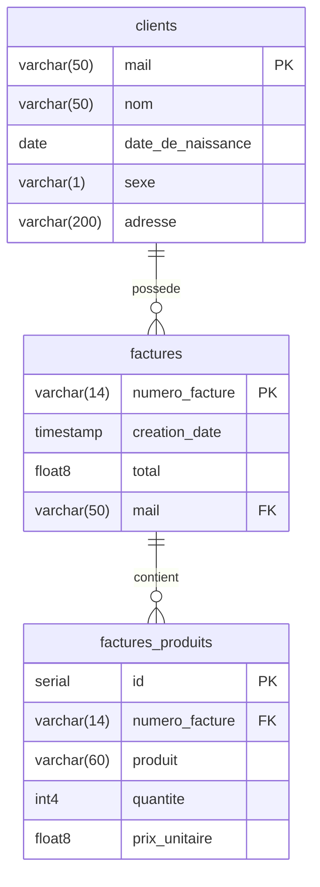
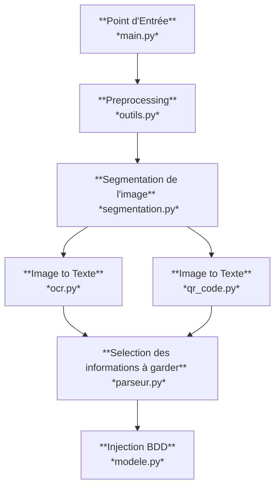
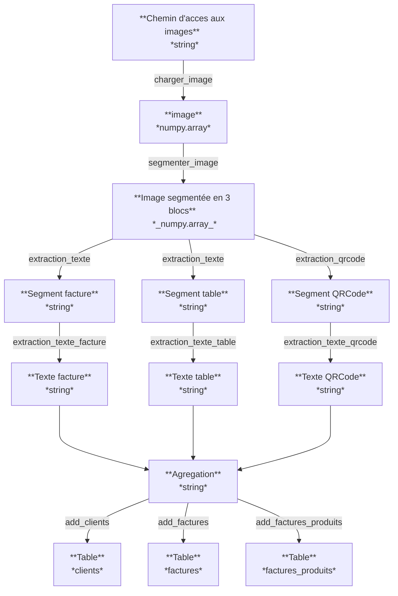

# ProjetOCR

Développer une interface OCR

## Installation

### creation environnement

```python
python -m venv ENV
```

### activation venv

```bash
ENV\Scripts\activate.bat 
```

### Installation librairies

```python
pip install -r requirements.txt
```

## Services

### Telechargement de toutes les factures

```python
python dlfact.py
```

## Les schémas

### Schéma de la base de données

Voici le schéma de la base de données illustré avec Mermaid :



### Schéma conceptuel

Voici le schéma conceptuel illustré avec Mermaid :



### Schéma fonctionnel

Voici le schéma fonctionnel illustré avec Mermaid :



## Application web

### lancement de l'application ( dossier App )

```python
uvicorn main:app --reload
```

